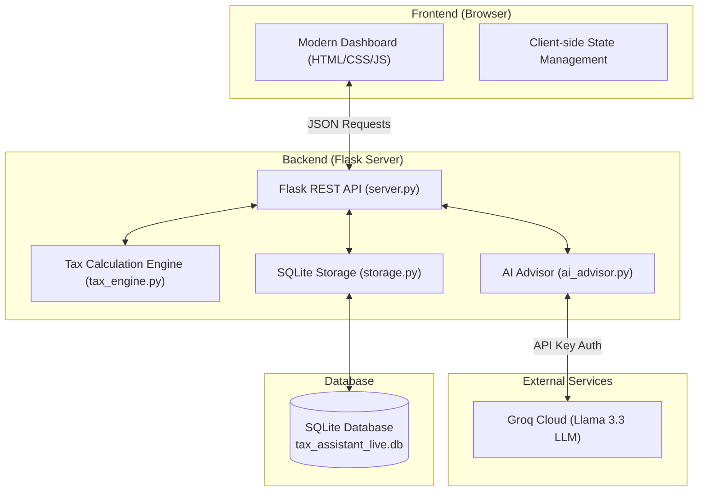
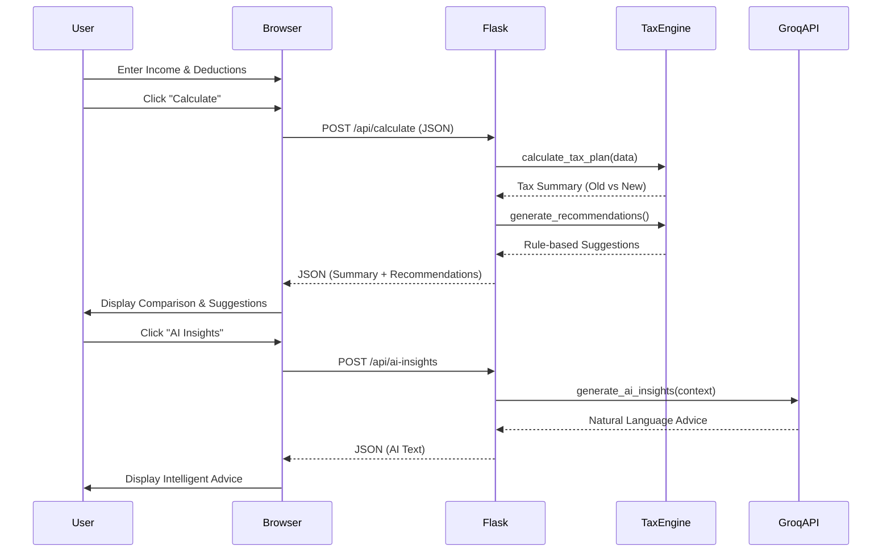

# 💰 Tax Saving Assistant (AI-Powered)

[](https://www.python.org/)
[](https://flask.palletsprojects.com/)
[](https://groq.com/)
[](https://opensource.org/licenses/MIT)

An intelligent, AI-assisted tax planning dashboard designed for Indian taxpayers. This platform helps users navigate the complexities of the **Old vs. New Tax Regimes (FY 2025-26)**, optimize deductions, and receive personalized AI-driven financial advice.

---

## 🚀 Overview

The **Tax Saving Assistant** simplifies financial planning by calculating estimated tax liabilities in real-time. It compares the two major Indian tax regimes and identifies the most beneficial path for the user. Beyond numbers, it integrates **Groq's Llama 3.3 AI** to provide human-like insights and a dedicated chat assistant for tax-related queries.

---

## ✨ Key Features

- **Dual-Regime Comparison**: Automatic calculation and comparison of Old and New Tax Regimes (FY 2025-26 slabs).
- **Intelligent Deductions**: Detailed breakdown of 80C, 80D, NPS, and interest-based deductions.
- **AI Insights**: Personalized tax-saving recommendations powered by Groq AI.
- **Interactive AI Chat**: Ask specific questions about your tax situation and get immediate context-aware answers.
- **Secure Authentication**: Built-in login and registration system with SQLite persistence.
- **Financial Reports**: Generate and download comprehensive text-based tax summaries.
- **Modern UI/UX**: Premium, responsive dashboard with dynamic glassmorphism and real-time updates.

---

## 🏗️ Architecture

The system follows a modular client-server architecture:



### Component Breakdown:
- **Frontend**: A vanilla JavaScript SPA (Single Page Application) approach using modern CSS and Tailwind for high-performance rendering.
- **Tax Engine**: A specialized Python module implementing the latest Indian Income Tax slabs and capping rules for various sections (80C, 80D, 80CCD, etc.).
- **AI Layer**: Integrates with Groq via its high-speed inference engine to provide instant planning recommendations.
- **Persistence**: SQLite manages user accounts and saves previous tax planning sessions.

### Data Flow (Calculation)


---

## 🛠️ Tech Stack

- **Languages**: Python, JavaScript, HTML5, CSS3
- **Frameworks**: Flask (Backend)
- **AI Engine**: Groq API (Llama-3.3-70b-versatile)
- **Database**: SQLite3
- **Styling**: Vanilla CSS, Modern Typography, HSL Color Palettes
- **Environment**: Python 3.9+

---

## 📦 Project Structure

```text
.
├── ai_advisor.py       # AI integration logic (Groq)
├── app.js              # Main frontend logic & API communication
├── app.py              # Legacy entry point
├── dashboard.html      # Main planning dashboard UI
├── index.html          # Landing page
├── login.html          # Authentication page (Login/Register)
├── server.py           # Flask backend entry point
├── storage.py          # SQLite database operations
├── styles.css          # Premium custom styling
├── tax_engine.py       # Core tax calculation logic
├── tax_plans.db        # SQLite database (autogenerated)
└── requirements.txt    # Project dependencies
```

---

## 🚦 Getting Started

### 1. Prerequisites
- Python 3.9 or higher installed.
- A **Groq API Key** (Get one at [console.groq.com](https://console.groq.com/)).

### 2. Installation

Clone the repository and install dependencies:

```bash
pip install -r requirements.txt
```

### 3. Environment Setup

Create a `.env` file in the root directory or export variables in your terminal:

```bash
# Windows (PowerShell)
$env:GROQ_API_KEY="your_api_key_here"

# Linux/macOS
export GROQ_API_KEY="your_api_key_here"
```

### 4. Running the Application

Start the Flask server:

```bash
python server.py
```

The application will be available at: **`http://127.0.0.1:8503`**

---

## ⚖️ Tax Calculation Logic (FY 2025-26)

The assistant uses the following simplified assumptions for its engine:

### New Regime (Default)
- **Standard Deduction**: ₹75,000.
- **Tax Rebate**: Nil tax up to ₹12,00,000 taxable income (simplified).
- **Slabs**: Progressive rates from 5% to 30%.

### Old Regime
- **Standard Deduction**: ₹50,000.
- **Tax Rebate**: Nil tax up to ₹5,00,000 taxable income.
- **Slabs**: 5% (>2.5L), 20% (>5L), 30% (>10L).
- **Deduction Caps**: 
  - Section 80C: ₹1,50,000
  - Section 80CCD (NPS): ₹50,000
  - Section 80D (Medical): ₹25,000
  - Section 24 (Home Loan): ₹2,00,000

---

## 🤖 AI Interaction

The AI component acts as your personal financial advisor. It:
1.  Analyzes your calculation results.
2.  Identifies missing deduction opportunities.
3.  Suggests specific investment vehicles based on your profile.
4.  Answers follow-up questions via the integrated **Tax Chatbot**.

---

## 📝 License

This project is licensed under the MIT License - see the LICENSE file for details.

---

## ⚠️ Disclaimer

This tool is for **educational and planning purposes only**. Indian tax laws are complex and subject to change. Always consult with a qualified Chartered Accountant (CA) or tax professional before filing your taxes. The calculations provided are estimates based on simplified rule sets.
